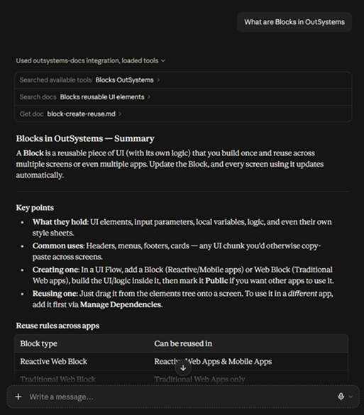

# OutSystems-Docs MCP (unofficial)

A local [MCP](https://modelcontextprotocol.io) server that gives your AI agent semantic search over the OutSystems ODC & O11 documentation - with verified source links and a freshness timestamp. Runs fully local (offline embeddings, no hosted services).

> Unofficial / community project. Docs are (C) OutSystems (CC BY-NC-ND 4.0); this tool keeps everything local and never redistributes them.

---

Credit: Original project by [donnieprakoso](https://github.com/donnieprakoso) - Thanks for the great foundation!  
*Inspired by his tagline: `:wq!` and made it better!*

Enhancements:

- Windows installer for one-click setup - [download from releases](https://github.com/madharjan/outsystems-docs/releases/latest)
- GPU acceleration (DirectML) AMD/Intel/NVIDIA GPU via DirectML, with automatic CPU fallback
- Fixed path resolution so the server works regardless of launch directory
- Faster CLI - no MCP server startup cost on `--sync` and other commands
- Windows symlink workaround for the Hugging Face cache
- Agent configuration: add/remove/status/backup/restore in one command
- Additional logging and documentation in `docs/` folder.
- Richer MCP results: every `search_docs`/`get_doc` result now carries `url`, `category`, and `last_updated` - see [MCP Definitions](docs/MCP_DEFINITIONS.md)
- Windows builds trust Zscaler and Cloudflare corporate proxies automatically, so syncing docs and downloading the AI model works on locked-down company networks

---

## Get started

Prerequisites: [`uv`](https://docs.astral.sh/uv/), Python 3.10+, and supported AI agents (see [Agent Configuration](docs/AGENT_CONFIG.md)).

Clone the repo (same on every OS):

```bash
git clone <your-repo-url> outsystems-docs
cd outsystems-docs
```

Then build the local docs index - `scripts\run.cmd`/`scripts/run.sh` create the `.venv` (via `uv sync`) on first run automatically:

Windows (cmd):

```cmd
scripts\run.cmd --sync
```

macOS / Linux:

```bash
./scripts/run.sh --sync
```

The first sync downloads a ~100 MB embedding model and builds a local vector index in `data/` (offline from then on). Re-run anytime to refresh the docs.

## Sync the docs

Windows (cmd):

```cmd
scripts\run.cmd --sync
scripts\run.cmd --sync --source odc
scripts\run.cmd --sync --source o11
```

macOS / Linux:

```bash
./scripts/run.sh --sync
./scripts/run.sh --sync --source odc
./scripts/run.sh --sync --source o11
```

## Add it to your agent

Automated (recommended):

Windows (cmd):

```cmd
scripts\run.cmd --agent-add claude_code
scripts\run.cmd --agent-status
scripts\run.cmd --agent-interactive
scripts\run.cmd --agent-backup claude_code
scripts\run.cmd --agent-restore claude_code
```

macOS / Linux:

```bash
./scripts/run.sh --agent-add claude_code
./scripts/run.sh --agent-status
./scripts/run.sh --agent-interactive
./scripts/run.sh --agent-backup claude_code
./scripts/run.sh --agent-restore claude_code
```

See [Agent Configuration](docs/AGENT_CONFIG.md) for the full list of supported agents.

Example - this is what `--agent-add claude_desktop` writes into `claude_desktop_config.json` (edit it by hand instead if you'd rather skip the script):

Windows:

```json
{
  "mcpServers": {
    "outsystems-docs": {
      "command": "C:\\path\\to\\outsystems-docs\\scripts\\run.cmd"
    }
  }
}
```

macOS / Linux:

```json
{
  "mcpServers": {
    "outsystems-docs": {
      "command": "/path/to/outsystems-docs/scripts/run.sh"
    }
  }
}
```

Manual - Claude Code:

Windows (cmd):

```cmd
claude mcp add outsystems-docs -- C:\path\to\outsystems-docs\scripts\run.cmd
```

macOS / Linux:

```bash
claude mcp add outsystems-docs -- /path/to/outsystems-docs/scripts/run.sh
```

Or let an agent install it - paste this prompt into your coding agent:

```txt
Clone <your-repo-url>, then run scripts\run.cmd --sync (Windows) or
./scripts/run.sh --sync (macOS/Linux) to build the local docs index.
Register that same script (no args) as a stdio MCP server named "outsystems-docs".
Then call search_docs to confirm it works.
```

## What you get



| Capability                                  | What it does                                                                                                                            |
| ------------------------------------------- | --------------------------------------------------------------------------------------------------------------------------------------- |
| `search_docs(query, k, source?, category?)` | Semantic search; optional `odc`/`o11` and TOC-section filters; every result includes its verified `url`, `category`, and `last_updated` |
| `get_doc(source, path)`                     | Full Markdown of a single doc, with its `url` and `last_updated`                                                                        |
| `llms://index` (resource)                   | Combined, labeled ODC + O11 navigation                                                                                                  |
| `last_updated`                              | When your local docs were last synced                                                                                                   |
| Verified links                              | URLs resolved against the official sitemap (never broken)                                                                               |
| Fully local                                 | Offline embeddings + NumPy search; nothing leaves your machine                                                                          |

See [MCP Definitions](docs/MCP_DEFINITIONS.md) for full parameter/response schemas.

## FAQ

1. How does it work? `--sync` fetches the official docs, generates `llms.txt`/`llms-full.txt`, and builds a local vector index. The server loads those and answers `search_docs` by embedding your query locally and ranking by cosine similarity.

2. Is it accurate? Answers come from the official OutSystems docs and link back to verified URLs. Results are only as fresh as your last sync - check the timestamp shown with each answer.

3. How do I sync? `scripts\run.cmd --sync` (Windows) or `./scripts/run.sh --sync` (macOS/Linux); add `--source odc` or `--source o11` to limit; `--no-links` to skip URL resolution.

4. How do I make it sync automatically? Schedule it locally - no CI (license: don't redistribute). Example cron (daily 7am, macOS/Linux):

   ```cron
   0 7 * * * cd /path/to/outsystems-docs && ./scripts/run.sh --sync >> sync.log 2>&1
   ```

   On macOS you can use a `launchd` LaunchAgent with `StartCalendarInterval` instead. On Windows, use Task Scheduler to run `scripts\run.cmd --sync` on a daily trigger.

---

Feel free to open an issue or share feedback.
